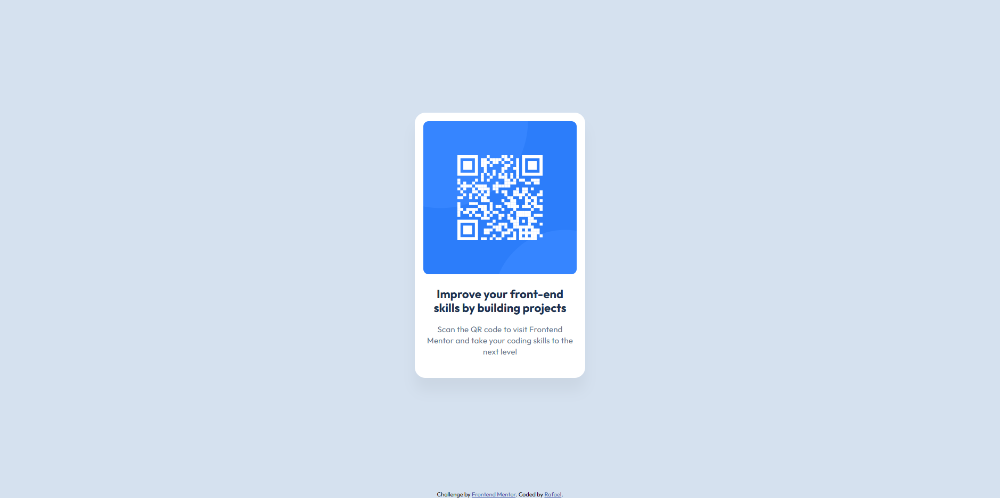

# Frontend Mentor - QR code component solution

This is a solution to the [QR code component challenge on Frontend Mentor](https://www.frontendmentor.io/challenges/qr-code-component-iux_sIO_H).

## Table of contents

- [Overview](#overview)
  - [Screenshot](#screenshot)
  - [Links](#links)
- [My process](#my-process)
  - [Built with](#built-with)
  - [What I learned](#what-i-learned)
  - [Continued development](#continued-development)
- [Author](#author)

## Overview

### Screenshot



### Links

- Solution URL: [Add solution URL here](https://github.com/0rafae1/qr-code-component)
- Live Site URL: [Add live site URL here](https://0rafae1.github.io/qr-code-component/)

## My process

### Built with

- Semantic HTML5 markup
- CSS custom properties
- Flexbox

### What I learned

During the project, I strengthened important HTML and CSS fundamentals, mainly around layout structuring and clean styling practices.

I used Flexbox to center elements properly and organized the components by separating layout responsibilities. I chose to use `gap` to create spacing that is more consistent and easier to maintain between elements.

I also applied semantic CSS variables to manage colors and shadows, which improves scalability and maintainability:

```css
:root {
  --color-bg: hsl(212, 45%, 89%);
  --color-card: hsl(0, 0%, 100%);
  --color-title: hsl(218, 44%, 22%);
  --color-text: hsl(216, 15%, 48%);
  --shadow-card: 0 25px 25px 0 rgba(0, 0, 0, 0.0477);
}
```

To structure the component in a more modular way, related elements were grouped together, such as wrapping the text content in a `.card-text` container to better control spacing and styling.

### Continued development

In future projects, I want to focus more on creating layouts using a mobile-first approach, ensuring responsiveness is considered from the start, rather than adapted later.

I also want to improve my skills in:

* Creating more scalable design systems (colors, spacing, typography)
* Writing cleaner and more reusable CSS
* Improving responsiveness using media queries when necessary

Additionally, I plan to refine my knowledge of layout techniques such as Flexbox and CSS Grid to handle more complex interfaces.

## Author

- LinkedIn - [Rafael Sousa](https://www.linkedin.com/in/orafael-sousa)
- Frontend Mentor - [@0rafae1](https://www.frontendmentor.io/profile/0rafae1)
- Outlook - [E-mail](mailto:rafaeltowork@outlook.com)
