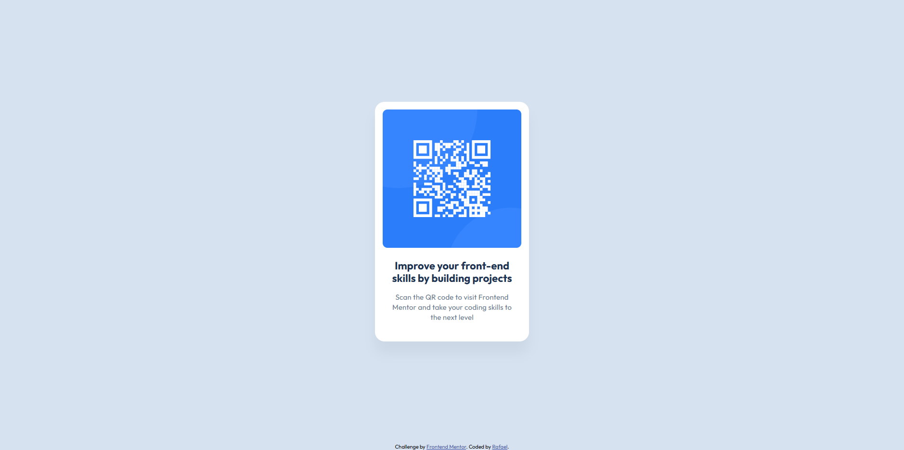

# Frontend Mentor - QR code component solution

This is a solution to the [QR code component challenge on Frontend Mentor](https://www.frontendmentor.io/challenges/qr-code-component-iux_sIO_H).

## Table of contents

- [Overview](#overview)
  - [Screenshot](#screenshot)
  - [Links](#links)
- [My process](#my-process)
  - [Built with](#built-with)
  - [What I learned](#what-i-learned)
  - [Continued development](#continued-development)
- [Author](#author)

## Overview

### Screenshot



### Links

- Solution URL: [Add solution URL here](https://github.com/0rafae1/qr-code-component)
- Live Site URL: [Add live site URL here](https://0rafae1.github.io/qr-code-component/)

## My process

### Built with

- Semantic HTML5 markup
- CSS custom properties
- Flexbox
- [Google Fonts](https://fonts.google.com/) - For typography
- Modern CSS functions (`clamp()`, `min()`) - For fluid responsiveness
- Dynamic Viewport Units (`100dvh`) - For better mobile browser support

### What I learned

During this project, I focused on creating a responsive layout using modern CSS techniques that minimize the need for complex Media Queries. I learned how to use CSS functions to calculate sizes dynamically:

- Fluid Responsiveness: I used `min()` to control the card's maximum width and `clamp()` to allow the title font size to scale smoothly between mobile and desktop viewports.
- Dynamic Units: I implemented `100dvh` for the main container, which ensures the content is perfectly centered even on mobile browsers where address bars can affect the viewport height.
- Semantic Structure: I used `<figure>` and `<figcaption>` to group the QR code image and its description correctly from a semantic standpoint.

Example of the fluid typography and layout logic I'm proud of:

```css
/* Title with fluid size between 1.25rem and 1.375rem */
--fs-title: clamp(1.25rem, 1.1rem + 0.5vw, 1.375rem);

/* Card that occupies 100% width but caps at 20rem */
.card {
    width: min(100%, 20rem);
}
```

### Continued development

In future projects, I want to focus more on creating layouts using a mobile-first approach, ensuring responsiveness is considered from the start, rather than adapted later.

I also want to improve my skills in:

* Creating more scalable design systems (colors, spacing, typography)
* Writing cleaner and more reusable CSS
* Improving responsiveness using media queries when necessary

Additionally, I plan to refine my knowledge of layout techniques such as Flexbox and CSS Grid to handle more complex interfaces.

## Author

- LinkedIn - [Rafael Sousa](https://www.linkedin.com/in/orafael-sousa)
- Frontend Mentor - [@0rafae1](https://www.frontendmentor.io/profile/0rafae1)
- Outlook - [E-mail](mailto:rafaeltowork@outlook.com)
